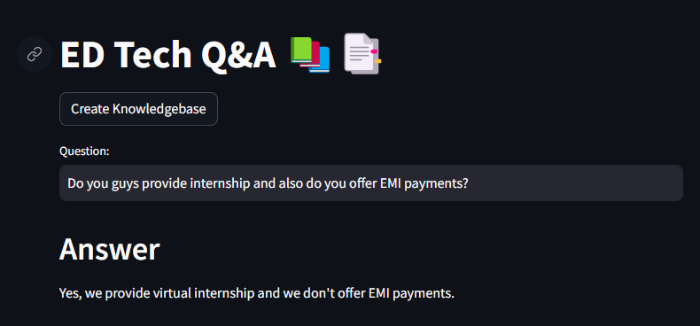
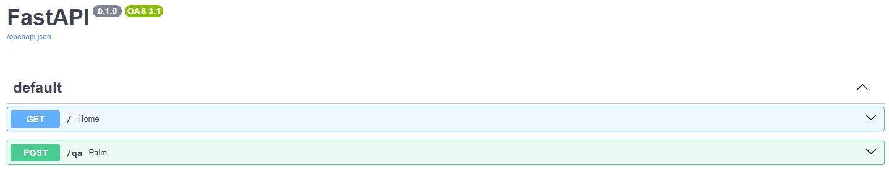

# Q&A: Question and Answer System Based on Google Palm LLM and Langchain

This is an end to end LLM project based on Google Palm and Langchain. We are building a Q&A system for an e-learning company. Company sells data related courses and bootcamps. They have thousands of learners who uses discord server or email to ask questions. This system will provide an API and a streamlit based user interface for students where they can ask questions and get answers.

## Project Highlights

- Use a real CSV file of FAQs that Codebasics company is using right now. 
- Their human staff will use this file to assist their course learners.
- We will build an LLM based question and answer system that can reduce the workload of their human staff.
- Students should be able to use this system to ask questions directly and get answers within seconds

## You will learn following,
  - Langchain + Google Palm: LLM based Q&A
  - Streamlit: UI
  - Huggingface instructor embeddings: Text embeddings
  - FAISS: Vector databse

## Installation

1.Clone this repository to your local machine using:

```bash
   git clone https://github.com/AquibPy/Q-A-LLM.git
```
2.Navigate to the project directory:

```bash
  cd dir_name
```

3.Install the required dependencies using pip:

```bash
  pip install -r requirements.txt
```
4.Acquire an api key through makersuite.google.com and put it in .env file

```bash
  GOOGLE_API_KEY="your_api_key_here"
```
## Usage

1. Run the Streamlit app by executing:
    ```bash
    streamlit run ui.py

    ```
    
2. Run the API  executing:

    ```bash
    uvicorn api:app --reload

    ```
<p align="center">
  <a href="https://fastapi.tiangolo.com"></a>
</p>
<p align="center">
    <em>FastAPI framework, high performance, easy to learn, fast to code, ready for production</em>

---

**Documentation**: <a href="https://fastapi.tiangolo.com" target="_blank">https://fastapi.tiangolo.com</a>

---

FastAPI is a modern, fast (high-performance), web framework for building APIs with Python 3.6+ based on standard Python type hints.

The key features are:

* **Fast**: Very high performance, on par with **NodeJS** and **Go** (thanks to Starlette and Pydantic). [One of the fastest Python frameworks available](#performance).

* **Fast to code**: Increase the speed to develop features by about 200% to 300%.
* **Fewer bugs**: Reduce about 40% of human (developer) induced errors.
* **Intuitive**: Great editor support. <abbr title="also known as auto-complete, autocompletion, IntelliSense">Completion</abbr> everywhere. Less time debugging.
* **Easy**: Designed to be easy to use and learn. Less time reading docs.
* **Short**: Minimize code duplication. Multiple features from each parameter declaration. Fewer bugs.
* **Robust**: Get production-ready code. With automatic interactive documentation.
* **Standards-based**: Based on (and fully compatible with) the open standards for APIs: <a href="https://github.com/OAI/OpenAPI-Specification" class="external-link" target="_blank">OpenAPI</a> (previously known as Swagger) and <a href="https://json-schema.org/" class="external-link" target="_blank">JSON Schema</a>.


### Interactive API docs

Now go to <a href="http://127.0.0.1:8000/docs" class="external-link" target="_blank">http://127.0.0.1:8000/docs</a>.

You will see the automatic interactive API documentation (provided by <a href="https://github.com/swagger-api/swagger-ui" class="external-link" target="_blank">Swagger UI</a>):




3.The web app will open in your browser.

- To create a knowledebase of FAQs, click on Create Knolwedge Base button. It will take some time before knowledgebase is created so please wait.

- Once knowledge base is created you will see a directory called faiss_index in your current folder

- Now you are ready to ask questions. Type your question in Question box and hit Enter

## Sample Questions
  - Do you guys provide internship and also do you offer EMI payments?
  - Do you have javascript course?
  - Should I learn power bi or tableau?
  - I've a MAC computer. Can I use powerbi on it?
  - I don't see power pivot. how can I enable it?

## Project Structure

- ui.py: The main Streamlit application script.
- helper_function.py: This contains helper functions
- requirements.txt: A list of required Python packages for the project.
- .env: Configuration file for storing your Google API key and Hugging Face API key.
